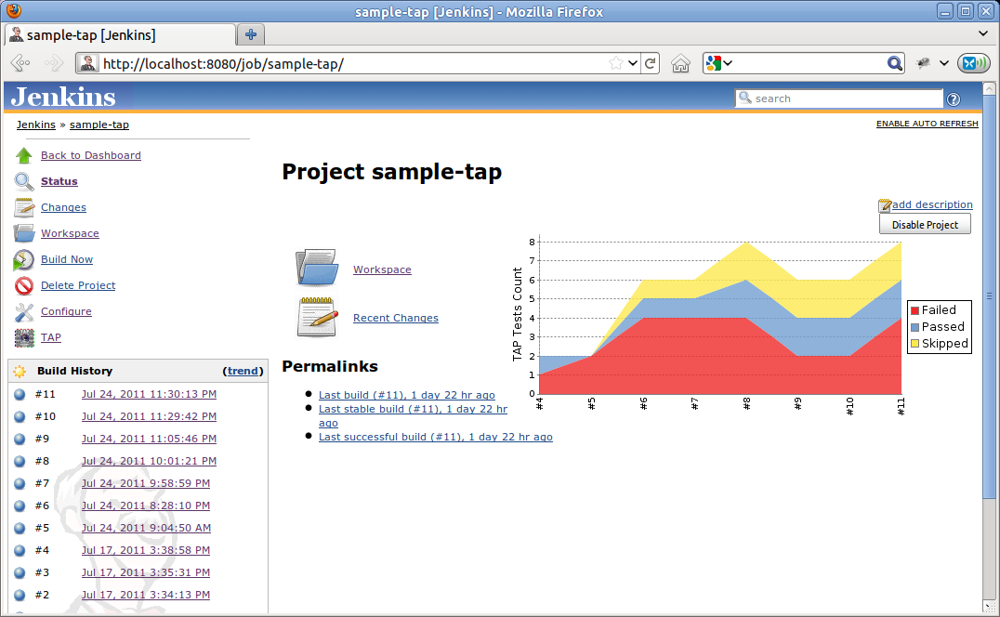
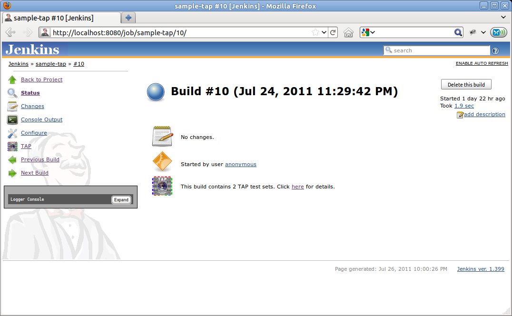
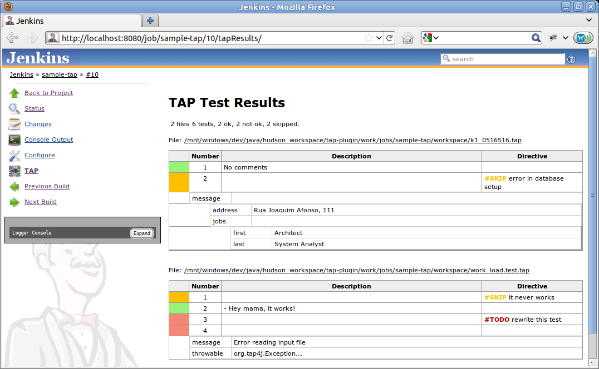

# TAP Plug-in

[](https://plugins.jenkins.io/tap)
[](https://github.com/jenkinsci/tap-plugin/blob/master/CHANGES.md)
[](https://plugins.jenkins.io/tap)
[](https://ci.jenkins.io/job/Plugins/job/tap-plugin/job/master/)
[](https://issues.jenkins.io/browse/JENKINS-64962?jql=component%20%3D%20%27tap-plugin%27%20AND%20resolution%20IS%20EMPTY%20ORDER%20BY%20updated%20DESC)

## Overview

This plugin adds support for [TAP](https://testanything.org/) test result files in Jenkins.

It lets you configure an Ant-style pattern to find your TAP files. The plugin scans the
matching files and creates test result views in Jenkins.

The TAP plugin depends on [tap4j](https://github.com/tupilabs/tap4j), a TAP implementation
for Java, and the [Jenkins JUnit plugin](https://plugins.jenkins.io/junit/).

> [!NOTE]
> You may get errors if the JUnit plugin is not active in your Jenkins instance.
> See [JENKINS-27227](https://issues.jenkins.io/browse/JENKINS-27227) for more details.

The plugin looks for TAP files like this:

```tap
1..2
ok 1 - Yahoo!
not ok 2 - org.tap4j.Error...
```

When a TAP stream is found, the plugin delegates parsing to tap4j. The parsed results
are then processed and displayed in Jenkins using graphs and custom pages.

### Understanding TAP streams in 2 minutes

The easiest way to learn TAP is by looking at examples. The following stream shows
two test cases, with comments explaining each line.

```tap
1..2 # The test plan: there are two test cases, numbered from 1 to 2.
ok 1 - Yahoo! # The first test passed successfully.
not ok 2 - org.tap4j.Error... # The second test failed and includes an exception message.
```

### Running Perl tests with prove

The plugin cannot process the default output generated by `prove`, because it contains
additional information besides TAP and causes the tap4j parser to fail.

The recommended approach is to use the Perl module
[TAP::Harness::Archive](http://search.cpan.org/~wonko/TAP-Harness-Archive-0.14/lib/TAP/Harness/Archive.pm).

For example, if your tests are inside the `t/` directory, you can archive the TAP
results with:

```bash
prove t/ --archive output
```

The result files are stored under output/t/. You can then configure the plugin with
a pattern such as:

```bash
t/**/*.t
```

### Using attachments

TAP supports attachments using *YAMLish*. If you are familiar with YAML, this format
should look familiar.

The following example includes an attachment:

```tap
1..2
  ok 1
  not ok 2 - br.eti.kinoshita.selenium.TestListVeterinarians#testGoogle
  ---
extensions:
  Files:
    my_message.txt:
      File-Title: my_message.txt
      File-Description: Sample message
      File-Size: 31
      File-Name: message.txt
      File-Content: TuNvIGNvbnRhdmFtIGNvbSBtaW5oYSBhc3T6Y2lhIQ==
      File-Type: image/png
  ...
```

The `Files` entry contains the attached files. The content must be Base64 encoded.

### Subtests (grouping or test suites)

Subtests allow you to group multiple TAP streams into a single stream. This works
similarly to test suites in JUnit or TestNG.

Indentation is important when using TAP subtests.

Note that subtests and YAMLish are not part of the official TAP 13 specification.

```yaml
  1..3
  ok 1 - First test
  1..2
  ok 1 - This is a subtest
  ok 2 - So is this
  1..2
  ok 1 - This is a subtest
  ok 2 - So is this
  ok 2 - An example subtest
  ok 3 - Third test
```

## Configuration

1. Install the Jenkins TAP plugin using the Plugin Manager or by manually copying the
   `.hpi` (or `.jpi`) file.
2. Enable TAP publishing in your job configuration and configure the file pattern
   and other settings.
3. Run your build and view the test results.

## Screenshots

#### Jenkins JUnit compatible reports and graphs



#### Custom actions for TAP too



#### YAMLish support



## Languages Supported

1. English (American)
2. Portuguese (Brazil) Work in Progress
3. Spanish (Thanks to César Fernandes de Almeida) Work in Progress

## Known Limitations

1. If the file type of the TAP report is considered as binary by the Jenkins webserver then the TAP plugin does not
   consider this file for inclusion in TAP reports (see [#15813](https://issues.jenkins-ci.org/browse/JENKINS-15813)
   for further details). To make sure your TAP report is considered for inclusion use e.g. the file name suffix `.tap` (
   so instead of a file named `report` use `report.tap`).

## Sponsors


For commercial support, please get contact us via [@tupilabs.com](https://bsky.app/profile/tupilabs.com) at BlueSky.

## Resources

1. This plug-in is going to be part of "Make your tests speak TAP" presentation in [JCertif](http://www.jcertif.com/)
   by [Bruno P. Kinoshita](http://www.kinoshita.eti.br/), in September 2011. In this presentation will also be presented
   the tap4j project, how to enable TAP in JUnit and TestNG, integrate [Perl](http://www.perl.org/) and
   [Java](http://www.oracle.com/java) tests and an [Eclipse TAP editor](https://github.com/kinow/tap-editor).
2. Gábor Szabó (2009), Test Reporting system: Smolder
   wish-list <http://szabgab.com/blog/2009/07/test-reporting-system-smolder-wish-list.html>.
3. Gábor Szabó (2009), Reporting Test Results <http://szabgab.com/blog/2009/04/reporting-test-results.html>.
4. [tap4j](http://www.tap4j.org/) - The TAP implementation for Java.
5. [Test Anything Protocol](http://www.testanything.org/) (official webpage).
6. [Performance tests with phantomjs and yslow](http://www.slideshare.net/guest94ab56d/2013-0717continuous-performancemonitoringwithjenkins)
   (uses the plug-in for plotting the TAP results)
7. [TAP Plugin for Matlab](http://www.mathworks.com/help/matlab/ref/matlab.unittest.plugins.tapplugin-class.html)

### JCertif 2011

[JCertif](http://www.jcertif.com/) - Make your tests speak TAP -
Speaker: [Bruno P. Kinoshita](http://www.kinoshita.eti.br/)  
September 2011 - Brazzaville, Congo


## Release Notes

Moved to [CHANGES.md](./CHANGES.md).

## Roadmap (wish list)

### Version 2.x

1. Update Jenkins API
2. Update tap4j to match the latest protocol specification (13 and 14)
3. Remove deprecated code
4. Simplify code (it's old!)

### Version 1.x

1. Add configurations like validate number of tests with test plan, a TODO causes a test to fail
2. Diagnostics image gallery Done! Fixed as
   a [new plug-in](https://wiki.jenkins-ci.org/display/JENKINS/Image+Gallery+Plugin)
3. Diagnostics exception code formatting
4. Add a link to open the file in the Build workspace (think about remote and local issues) Done!

## History

The idea for this plugin started after tap4j was created. After learning about
Smolder, it became clear that Jenkins could be used as a replacement by adding TAP
support and a UI for displaying test results.

After discussions on the Jenkins developer mailing list, Max, Nick, Bruno (tap4j),
and Cesar (tap4j) started working together on the initial design.

The first version of the plugin was released in July 2011.

The graph code was adapted from the TestNG plugin (thanks to its development team).
The diagnostics support (YAMLish) was implemented using Jelly, Java, and CSS.

## Simulating TAP streams with a Shell build step

You can use a [heredoc](https://en.wikipedia.org/wiki/Here_document)
to write a TAP file with Shell, and use it with the plug-in. This is
useful for testing.

```bash
#!/bin/bash

for x in {1..100}; do

cat > $x.tap <<EOF
ok 1
not ok 2
ok 3 # SKIP
not ok 4
ok 5
ok 6
ok 7
EOF

done ;
```
