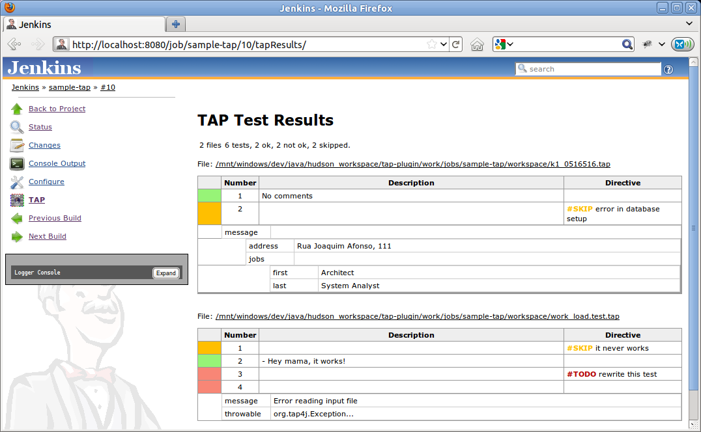

# TAP Plug-in

[](https://plugins.jenkins.io/tap)
[](https://github.com/jenkinsci/tap-plugin/blob/master/CHANGES.md)
[](https://plugins.jenkins.io/tap)
[](https://ci.jenkins.io/job/Plugins/job/tap-plugin/job/master/)
[](https://issues.jenkins.io/browse/JENKINS-64962?jql=component%20%3D%20%27tap-plugin%27%20AND%20resolution%20IS%20EMPTY%20ORDER%20BY%20updated%20DESC)

## Overview

This plug-in adds support to [TAP](https://testanything.org/) test result files to Jenkins.
It lets you specify an ant-like pattern for a directory that contains your TAP files and
scans and creates views for your test results in Jenkins.

TAP Plug-in depends on [tap4j](https://github.com/tupilabs/tap4j) - a TAP implementation
for Java, and on the [Jenkins JUnit Plug-in](https://plugins.jenkins.io/junit/).

> NOTE: You may get errors if the JUnit Plug-in is not active in your Jenkins instance
(see JENKINS-27227 for more).

## Overview

The plug-in looks for TAP files like the following one.

```tap
1..2
ok 1 - Yahoo!
not ok 2 - org.tap4j.Error...
```

When a TAP stream like the above is found, the plug-in delegates the
parsing the tap4j. The results of tap4j parsing are then analysed,
organized and displayed to the user as graphs and custom pages.

[comment]: <> (TODO: check if instantTAP is still the best way to validate it?)

You can test your TAP streams with tap4j, using [InstantTAP](http://instanttap.appspot.com/).

### Understanding TAP streams in 2 minutes

One of the easiest ways to learn something new is by examples. So here
we will show some examples of TAP streams. For being human-friendly, it
shouldn't confuse you. We will use comments to explain each line.

```tap
1..2 # a plan stating that we have two tests cases, from 1 to 2.
ok 1 - Yahoo! # the first test result was executed successfully and has a description of ' - Yahoo!'.
not ok 2 - org.tap4j.Error... # unfortunately, the second test result failed. The description here was used to display some nasty Exception.
```

### Running Perl tests with prove

The plug-in cannot handle prove's default output (since it includes more
information than simply TAP, and causes tap4j parser to fail). The best
way to handle the prove output is by using Perl module
[TAP::Harness::Archive](http://search.cpan.org/~wonko/TAP-Harness-Archive-0.14/lib/TAP/Harness/Archive.pm).
Supposing you have your tests under t/ directory, you can create another
directory (say, output) and archive your TAP tests with prove by using a
command line similar to the below:

```bash
prove t/ --archive output
```

The result files will be stored under *output/t/*. You can use a pattern
in the plug-in configuration like *t/\*****/****.t*.

### Using attachments

The following is a TAP with attachments, using YAMLish. If you are
familiar with YAML, this example should be very easy to read.

```yaml
1..2
  ok 1
  not ok 2 - br.eti.kinoshita.selenium.TestListVeterinarians#testGoogle
  ---
extensions:
  Files:
    my_message.txt:
      File-Title: my_message.txt
      File-Description: Sample message
      File-Size: 31
      File-Name: message.txt
      File-Content: TuNvIGNvbnRhdmFtIGNvbSBtaW5oYSBhc3T6Y2lhIQ==
      File-Type: image/png
  ...
```

The Files entry has an array of files. You have to Base64 encode your
content data.

### Subtests (grouping or test suites).

Subtests let you group several TAP streams unto a single one. This way,
you can organize your tests in similar fashion to JUnit or TestNG test
suites. Indentation is important for TAP subtests.

Subtests and YAMLish are not officially in TAP 13 specification

```yaml
  1..3
  ok 1 - First test
  1..2
  ok 1 - This is a subtest
  ok 2 - So is this
  1..2
  ok 1 - This is a subtest
  ok 2 - So is this
  ok 2 - An example subtest
  ok 3 - Third test
```

## Configuration

1. Install the Jenkins TAP Plug-in using the Plug-in Manager or manually by copying the `.hpi` (or `.jpi`) file
2. Check the option to publish TAP, configure a pattern (and other settings)
3. Execute your build and analyze the results

## Screenshots

#### Jenkins JUnit compatible reports and graphs


#### Custom actions for TAP too


#### YAMLish support



## Languages Supported

1. English (American)
2. Portuguese (Brazil)) Work in Progress
3. Spanish (Thanks to César Fernandes de Almeida) Work in Progress

## Known Limitations

1. If the file type of the TAP report is considered as binary by the Jenkins webserver then the TAP plugin does not
   consider this file for inclusion in TAP reports (see [#15813](https://issues.jenkins-ci.org/browse/JENKINS-15813)
   for further details). To make sure your TAP report is considered for inclusion use e.g. the file name suffix `.tap` (
   so instead of a file named `report` use `report.tap`).

## Sponsors

[{width="300"}](http://www.tupilabs.com/)

For commercial support, please get contact us
via [@tupilabs](https://twitter.com/tupilabs)

## Resources

1. This plug-in is going to be part of "Make your tests speak TAP" presentation in [JCertif](http://www.jcertif.com/)
   by [Bruno P. Kinoshita](http://www.kinoshita.eti.br/), in September 2011. In this presentation will also be presented
   the tap4j project, how to enable TAP in JUnit and TestNG, integrate [Perl](http://www.perl.org/) and
   [Java](http://www.oracle.com/java) tests and an [Eclipse TAP editor](https://github.com/kinow/tap-editor).
2. Gábor Szabó (2009), Test Reporting system: Smolder
   wish-list <http://szabgab.com/blog/2009/07/test-reporting-system-smolder-wish-list.html>.
3. Gábor Szabó (2009), Reporting Test Results <http://szabgab.com/blog/2009/04/reporting-test-results.html>.
4. [tap4j](http://www.tap4j.org/) - The TAP implementation for Java.
5. [Test Anything Protocol](http://www.testanything.org/) (official webpage).
6. [Performance tests with phantomjs and yslow](http://www.slideshare.net/guest94ab56d/2013-0717continuous-performancemonitoringwithjenkins)
   (uses the plug-in for plotting the TAP results)
7. [TAP Plugin for Matlab](http://www.mathworks.com/help/matlab/ref/matlab.unittest.plugins.tapplugin-class.html)

### JCertif 2011

[JCertif](http://www.jcertif.com/) - Make your tests speak TAP -
Speaker: [Bruno P. Kinoshita](http://www.kinoshita.eti.br/)  
September, 2011 - Brazzaville, Congo


## Release Notes

Moved to [CHANGES.md](./CHANGES.md).

## Roadmap (wish list)

### Version 2.x

1. Update Jenkins API
2. Update tap4j to match the latest protocol specification (13 and 14)
3. Remove deprecated code
4. Simplify code (it's old!)

### Version 1.x

1. Add configurations like validate number of tests with test plan, a TODO causes a test to fail
2. Diagnostics image gallery Done! Fixed as
   a [new plug-in](https://wiki.jenkins-ci.org/display/JENKINS/Image+Gallery+Plugin)
3. Diagnostics exception code formatting
4. Add a link to open the file in the Build workspace (think about remote and local issues) Done!

## History

The idea of the plug-in surged after tap4j was created. After learning
about Smolder, it became evident that Jenkins could be used as a
replacement for it. All that was needed was just adding TAP support to
Jenkins and implementing a nice UI to display the test results. After
some messages in jenkins-dev-list, Max and Nick commented about their
need to show test results in a different manner than how Jenkins was
doing at that moment. Soon after that Max, Nick, Bruno (tap4j) and
Cesar (tap4j) started to work together, exchanging mail messages and
discussing an initial design for this plug-in.

In July 2011 the first version of the plug-in was ready to be released.
The graph code used here was adapted from TestNG Plugin (big thanks to
the development team, great work). The diagnostic (YAMLish) was
implemented in Jelly + Java + CSS. And the road map was incremented
based on what Gábor Szabó posted about Smolder and testing reports in
his blog (see resources for links).

## Simulating TAP streams with a Shell build step

You can use a [heredoc](https://en.wikipedia.org/wiki/Here_document)
to write a TAP file with Shell, and use it with the plug-in. This is
useful for testing.

```bash
#!/bin/bash

for x in {1..100}; do

cat > $x.tap <<EOF
ok 1
not ok 2
ok 3 # SKIP
not ok 4
ok 5
ok 6
ok 7
EOF

done ;
```
